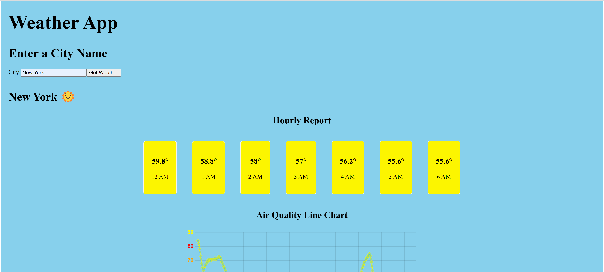
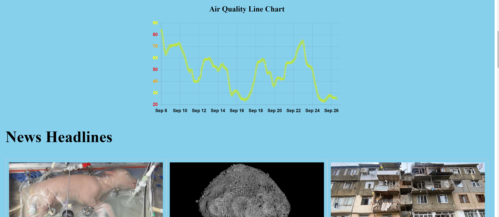

# Weather
## Description

We created a multipurpose weather app, which allows user to input a city name to view current weather report, airquality, and news updates. The weather data is collected live from Openmeteo weather API, and the news is collected from NEWSAPI. We were inspired by the air quality hazard by Canadian Wildfire in New York City few months ago. The project will have more features soon eg. receiving live suggestions on city weather and what precaution should be taken based on the weather results.

-----

## Tech Stacks 

- Geolocator
- Flask
- CSS
- HTML
- React js
  
## Development Tools 

- Visual Studio
- Git & GitHub
- Postman
  

## Functionality 

